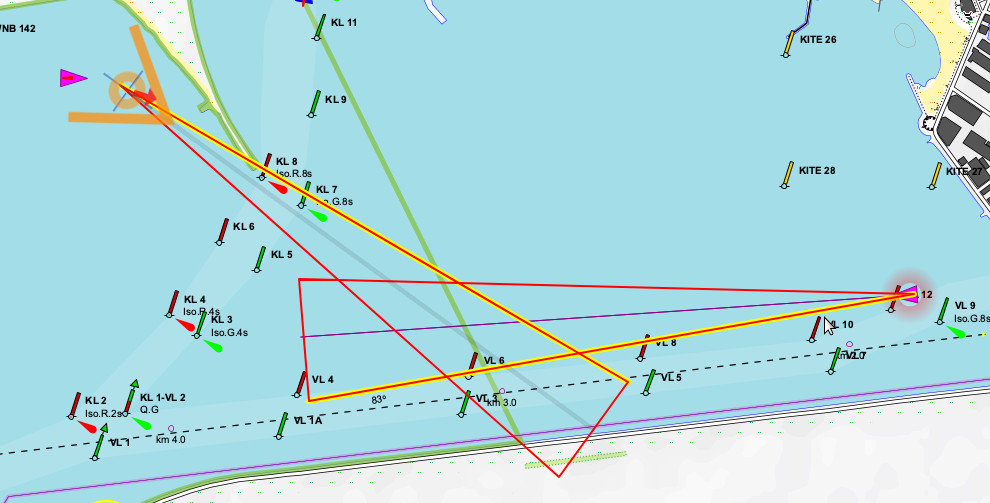

[Русское описание](README.ru-RU.md)  
# gpsdPROXY daemon [](https://creativecommons.org/licenses/by-nc-sa/4.0/deed.en)
**version 1**

It is very convenient to access the **[gpsd](https://gpsd.io/)** from web apps with asynchronous request [?POLL;](https://gpsd.gitlab.io/gpsd/gpsd_json.html#_poll) But there are problems:  

>**First**, the AIS data not available by ?POLL; request.  
>**Second**, the data other them time-position-velocity (from GNSS reciever, in general) may not be included to ?POLL; request.

The reason is that **gpsd** collect data during "epoch" from one GNSS fix recive to another. But "epoch" for AIS and instruments data is longer. So this data is not available for the ?POLL; request that returns the data collected during **gpsd** epoch in request moment.  
Details and discussion see:  
[https://lists.nongnu.org/archive/html/gpsd-users/2020-04/msg00093.html](https://lists.nongnu.org/archive/html/gpsd-users/2020-04/msg00093.html)  
[https://lists.nongnu.org/archive/html/gpsd-users/2021-06/msg00017.html](https://lists.nongnu.org/archive/html/gpsd-users/2021-06/msg00017.html)  

But this is a some strange software. Because the same functionality is present actually in **gpsd**: it collects a stream of data, aggregates it, and gives structured data on demand. The difference in the lifetime of the data. In **gpsdPROXY** it can be set explicitly and  separately by data type.  
I believe that such functionality must be in **gpsd**. But there is no such thing.

As a side, you may use **gpsdPROXY** to collect data from sources that do not have data lifetime control. For example, from VenusOS where there are no instruments data reliability control, or from SignalK, where there it timestamp at least.  
Other side effect is storing MOB data and calculate of collision capabilities for AIS targets.  
But you can just use **gpsdPROXY** as websocket proxy to **gpsd**.  
However, currently the **gpsdPROXY** is actually a back-end for [GaladrielMap](https://github.com/VladimirKalachikhin/Galadriel-map/tree/master). As such, it has many features poor described in the documentation.

This code is written without the use of AI, "best practices," OOP and IDE.

Contents:  
<ul>
	<li>
		<a href="#features">Features</a>
		<ul>
			<li>
				<a href="#data-source">Data source</a>
				<ul>
					<li>
					<a href="#venusos">VenusOS</a>
						<ul>
							<li><a href="#limitations">limitations</a></li>
						</ul>
					</li>
					<li>
					<a href="#signal-k">Signal K</a>
						<ul>
							<li><a href="#limitations-1">Limitations</a></li>
						</ul>
					</li>
				</ul>
			</li>
			<li><a href="#collision-detections">Collision detections</a></li>
			<li><a href="#mob-info">MOB info</a></li>
			<li><a href="#following-the-route">Following the route</a></li>
			<li>
				<a href="#data-exchange-between-client-applications">Data exchange between client applications</a>
			</li>
		</ul>
	</li>
	<li><a href="#compatibility">Compatibility</a></li>
	<li><a href="#install">Install</a></li>
	<li>
		<a href="#configure">Configure</a>
		<ul>
			<li><a href="#authorisation">Authorisation</a></li>
		</ul>
	</li>
	<li>
		<a href="#usage">Usage</a>
		<ul>
			<li><a href="#control">Control</a></li>
			<li>
				<a href="#gpsd-protocol-extensions">gpsd Protocol extensions</a>
				<ul>
					<li><a href="#new-parameters">New parameters</a></li>
					<li>
						<a href="#new-commands">New commands</a>
						<ul>
							<li><a href="#data-source-1">Data source</a></li>
							<li><a href="#waypoints-control">Waypoints control</a></li>
							<li>
								<a href="#panorama-control">Panorama control</a>
								<ul>
									<li>
										<a href="#viewpoint-and-viewing-direction-of-the-panorama">Viewpoint and viewing direction of the panorama</a>
									</li>
									<li><a href="#camera-parameters">Camera Parameters</a></li>
									<li><a href="#view-direction-control">View direction control</a></li>
								</ul>
							</li>
						</ul>
					</li>
				</ul>
			</li>
			<li><a href="#output">Output</a></li>
			<li><a href="#typical-client-code">Typical client code</a></li>
		</ul>
	</li>
	<li><a href="#demo">Demo</a></li>
	<li><a href="#support">Support</a></li>
</ul>


## Features
This cache/proxy daemon collect AIS and all TPV data from **gpsd** or other source during the user-defined lifetime and gives them by [?POLL;](https://gpsd.gitlab.io/gpsd/gpsd_json.html#_poll) request of the **gpsd** protocol.  
So data from AIS stream and instruments such as echosounder and wind meter become available via ?POLL; request.  
In addition, you may use ?WATCH={"enable":true,"json":true} stream, just like from original **gpsd**.   

Also it is a data multiplexer, collecting various data from various sources to provide them to clients in unify interface.

You can specify multiple addresses and ports to connect to, for example, in ipv4 and ipv6 networks.

### Data source
Normally, the gpspPROXY works with **gpsd** on the same or the other machine. In this case, the data is the most complete and reliable.  

#### VenusOS
The **gpsdPROXY** can work in VenusOS v2.80~38 or above. Or get data from any version via LAN. To do this, you need to enable "MQTT on LAN" feature. On VenusOS remote console go Settings -> Services -> MQTT on LAN (SSL) and Enable.

##### limitations
* VenusOS does not provide depth and AIS services.
* The data provided by VenusOS are not reliable enough, so be careful.

#### Signal K
The **gpsdPROXY** can get data from Signal K local or via LAN. If it possible, **gpsdPROXY** find Signal K by yourself via zeroconf service or jast on standard port.

##### Limitations
Indeed, SignalK can be used from **gpsdPROXY** only local. Via LAN it's odd.

### Collision detections
The **gpsdPROXY** tries to determine the possibility of a collision according to the adopted simplified collision model based on the specified detection distance and the probability of deviations from the course.  
<br>  
Output collisions data contains a list of mmsi and position of vessels that have a risk of collision. The [GaladrielMap](https://github.com/VladimirKalachikhin/Galadriel-map) highlights such vessels on the map and indicates the direction to them on self cursor.  
For the Collision detector to work correctly, you must specify the boat parameters in _params.php_.

### MOB info
The **gpsdPROXY** supports the exchange of "man overboard" information between connected clients. Output MOB data contains a GeoJSON-like object with MOB points and lines.  
In addition, there is a support for AIS Search and Rescue Transmitter (SART) messages AIS-MOB and AIS-EPIRB as a local MOB alarm. Besides, the [netAIS](https://github.com/VladimirKalachikhin/netAIS) alarm and MOB messages also supported.

### Following the route
In response to the command `?WPT={"action":"start","wayFileName":"fileName.gpx"};` the **gpsdPROXY** loads the file *fileName.gpx* and searches for a \<rte\> object with the text "current" in the \<cmt\> field. If this, the **gpsdPROXY** finds the \<wpt\> closest to the current position in this \<rte\>,  and makes it the current waypoint.  
The **gpsdPROXY** makes sure that the current position is no further than the specified distance from the waypoint and, when it is reached, determines the next waypoint.  
The result is given to clients subscribed to the "WPT" messages as object {"class" : "WPT"}.  
You can cancel following with the command `?WPT={"action":"cancel"};`  
Control: `?WPT={"action":"nextWPT"};`, `?WPT={"action":"prevWPT"};`  
If the file *fileName.gpx* does not contain a \<rte\> object with the text "current" in the \<cmt\> field, then will take the \<wpt\>'s, starting from the one marked as "current" if it is. If there are no \<wpt\>'s, the last \<rte\> will be used.  
If the file "fileName.gpx" is changed, it is reloaded and following continues from the nearest point.


### Data exchange between client applications
In fact, there is only the management of the [DEMpanoPanel](https://github.com/VladimirKalachikhin/DEMpanoPanel) instance from an instance of [GaladrielMap](https://vladimirkalachikhin.github.io/Galadriel-map). So, data exchange between client applications is designed in the form of panorama control commands: `?PANO={"clientToName":"Client name","action":{}};`, which are described below.  
Perhaps someday a separate chat between instances of client applications will be implemented, if it is needed for some reason.


## Compatibility
Linux, PHP\<8. The cretinous decisions made at PHP 8 do not allow the **gpsdPROXY** to work at PHP 8, and I do not want to follow these decisions.

## Install
Just copy files to any dir and configure.

## Configure
See _params.php_  

### Authorisation
A simple authorization system is designed to divide users into those who have access to all features and those whose possibilities are limited.  
The limitations are that there is no access to the next commands:  

* `CONNECT`
* `UPDATE`
* `WPT`
* `PANO`

You can specify a list of addresses or/and subnets from which full access is allowed (white list) or, conversely, a list of addresses and subnets from which full access is prohibited (black list). See `params.php` for details.  

## Usage
```
$ php gpsdPROXY.php
```
Connect to the daemon on host:port from _params.php_ by **gpsd** protocol via BSD socket or websocket.

### Control
**gpsdPROXY** daemon checks whether the instance is already running, and exit if it.  

### gpsd Protocol extensions
#### New parameters
Added some new parameters for commands:

* `"subscribe":"TPV,ATT,ALARM,AIS,WPT,PANO,SELF"` parameter for ?POLL and ?WATCH={"enable":true,"json":true} commands.  
This indicates to return TPV or AIS or ALARM data only, or a combination of them. Default - all.  
For example: `?POLL={"subscribe":"AIS"}` return class "POLL" with "ais":[], not with "tpv":[].
* `"minPeriod":0`, sec. for WATCH={"enable":true,"json":true} command. Normally the data is sent at the same speed as they come from sensors. Setting this allow get data not more often than after the specified number of seconds. For example:  
WATCH={"enable":true,"json":true,"minPeriod":"2"} sends data every 2 seconds.
* `"clientName":"string"` Optional ID of the client application instance. It is important mainly for managing the panorama.
* `"PANOrole":"master | slave | both"` One of the specified. It is used only to notify applications about available features.

#### New commands
##### Data source

`?CONNECT={"host":"","port":""};` Requires you to connect to the specified address as to **gpsd**.  
`?UPDATE={"updates":""};` Getting data in **gpsd** format.  

##### Waypoints control

`?WPT={"action":"start","wayFileName":"fileName.gpx"};` Start following  
`?WPT={"action":"cancel"};` Stop following  
`?WPT={"action":"nextWPT"};` Next waypoint  
`?WPT={"action":"prevWPT"};` Previous waypoint  

##### Panorama control
The general view of the panorama control commands is as follows:  
`?PANO={"clientToName":"Client name","action":{}};`  
where `action` is an arbitrary JSON object.

Currently, the following `action` objects exist:

###### Viewpoint and viewing direction of the panorama  
It is usually sent by the control program to the panorama.
```
"setViewPoint":{
		"point" : {"lng" : 27.515259, "lat" : 60.103195},
		"bearing" : 45
	}
}
```
A "point" is an L.Point Leaflet object or, equivalently, an LngLatLike MapLibre GL JS object.  
"bearing" - in degrees.

####### The transmitted point
Some kind of point.  
It is usually transmitted by the panorama to the control program, indicating the point clicked by the user. Upon receipt, GaladrielMap turns on the "Route" mode and puts a crosshair at this point.
```
"POI":{
	"point" : {"lng" : 27.515259, "lat" : 60.103195}
}
```

###### Camera Parameters
It is usually transmitted by the panorama to the control program to report on the actual camera parameters after setting the viewpoint or changing the viewing direction.

`"cameraOptions":cameraOptions`  

`cameraOptions` are the camera parameters as they are described in the documentation for MapLibre GL JS.  
In addition, there may be fields:  
`panoControlFollowSwitch` is the current state of "follow coordinates", and  
`panoControlKioskModeSwitch` - the current status is "show control panel".

###### View direction control
It is passed to the panorama by the control program to control the view without changing the point of view and to change the mode.  
One of the specified commands:

`"cameraCommand":"LEFT | RIGHT | UP | DOWN | FORWARD | BACK | followON | followOFF | kioskmodeON | kioskmodeOFF"`


### Output
The output same as described for **gpsd**, exept:  

* The DEVICES response of the WATCH command include one device only: the daemon self. So no need to merge data from similar devices -- the daemon do it.
* _sky_ array in POLL object is empty.
* The AIS object does not contain _scaled_ and _device_ fields, it contains the _ais_ array only: `ais:{mmsi:{}}` 
with value as described in [AIS DUMP FORMATS](https://gpsd.gitlab.io/gpsd/gpsd_json.html#_ais_dump_formats) section, except:  

* All data (include AIS) in SI units:
>* Speed in m/sec
>* Location in degrees
>* Angles in degrees
>* Draught in meters
>* Length in meters
>* Beam in meters
* undefined values is __null__
* No 'second' field, but has 'timestamp' as unix time.
* The 'depth' value from the TPV class data is also present in the ATT class data
* The 'temp' value from the TPV class data is also present in the ATT class data
* The all wind values from the TPV class data is also present in the ATT class data
* The 'wtemp' value from the TPV class data is also present in the ATT class data
>In the future, all these values will remain only in the data of the ATT class.
* The AIS class contain only:
```
{"class":"AIS",
"ais":{
	"vessel_mmsi":{
		...
		vessel data
		...
```
In addition, the **gpsd** protocol is extended by the following classes:  
_ALARM_, _WPT_,_PANO_,_SELF_


### Typical client code
```
let subscribe = `?WATCH={
	"enable":true,
	"json":true,
	"clientName":${ClientName},
	"minPeriod": 0,
	"subscribe":"TPV,ATT,ALARM,AIS,WPT,PANO,SELF",
	"PANOrole":"master"	// "slave", "both"
};`;

webSocket = new WebSocket("ws://"+gpsdProxyHost+":"+gpsdProxyPort);

webSocket.onopen = function(e) {
	console.log("spatialWebSocket open: Connection established");
};

webSocket.onmessage = function(event) {
	let data;

	data = JSON.parse(event.data);

	switch(data.class){
	case 'VERSION':
		console.log('webSocket: Handshaiking with gpsd begin: VERSION recieved. Sending WATCH');
		webSocket.send(subscribe);
		break;
	case 'DEVICES':
		console.log('webSocket: Handshaiking with gpsd proceed: DEVICES recieved');
		break;
	case 'WATCH':
		console.log('webSocket: Handshaiking with gpsd complit: WATCH recieved.');
		break;
	case 'TPV':
		console.log('webSocket: recieved TPV:',data);
		break;
	case 'ATT':
		console.log('webSocket: recieved ATT:',data);
		break;
	case 'AIS':
		console.log('webSocket: recieved AIS:',data);
		break;
	case 'ALARM':
		for(const alarmType in data.alarms){
			switch(alarmType){
			case 'MOB':
				console.log('webSocket: recieved MOB alarm',data.alarms.MOB);
				break;
			case 'collisions':
				console.log('webSocket: recieved collision alarm:',data.alarms.collisions);
				break;
			};
		};
		break;
	case 'WPT':
		console.log('webSocket: recieved WPT:',data);
		break;
	case 'PANO':
		console.log('webSocket: recieved PANO:',data);
		break;
	case 'SELF':
		console.log('webSocket: recieved SELF:',data);
		break;
	};
};

webSocket.onclose = function(event) {
	console.log('webSocket closed: connection broken with code '+event.code+' by reason ${event.reason}');
};

webSocket.onerror = function(error) {
	console.log('webSocket error');
};

```

## Demo
There are several [ready-to-use images available](https://github.com/VladimirKalachikhin/GaladrielMap-Demo-image/) that include the gpsdPROXY.


## Support
[Forum](https://github.com/VladimirKalachikhin/Galadriel-map/discussions)

The forum will be more lively if you make a donation at [ЮMoney](https://sobe.ru/na/galadrielmap)

[Paid personal consulting](https://kwork.ru/it-support/20093939/galadrielmap-installation-configuration-and-usage-consulting)  
