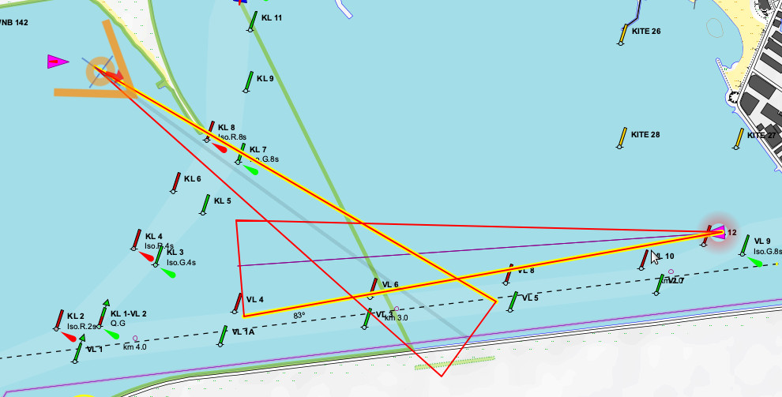

[In English](README.md)  
# gpsdPROXY daemon [](https://creativecommons.org/licenses/by-nc-sa/4.0/deed.en)
**version 1**  

Весьма удобно обращаться к **[gpsd](https://gpsd.io/)** из веб-приложений посредством команды [?POLL;](https://gpsd.gitlab.io/gpsd/gpsd_json.html#_poll) в произвольный момент времени, однако есть проблемы:
  
>**во-первых**, данные AIS недоступны в команде ?POLL;  
>**во-вторых**, данные, отличные от тех, что отдаёт приёмник ГПС, могут не попасть в команду ?POLL;

Причина в том, что **gpsd** собирает данные в течение "эпохи" от одного получения координат приёмником ГПС до другого. Но "эпоха" для данных AIS и приборов гораздо длиннее, и эти данные не попадают в запрос ?POLL;  
С деталями и дискуссией по этому поводу можно ознакомиться по следующим ссылкам (англ.):  
[https://lists.nongnu.org/archive/html/gpsd-users/2020-04/msg00093.html](https://lists.nongnu.org/archive/html/gpsd-users/2020-04/msg00093.html)  
[https://lists.nongnu.org/archive/html/gpsd-users/2021-06/msg00017.html](https://lists.nongnu.org/archive/html/gpsd-users/2021-06/msg00017.html)  

Однако надо заметить, что **gpsdPROXY** довольно странная программа, потому что она, в общем, делает ровно то же самое, что и собственно **gpsd**: собирает данные из потока, агрегирует их и отдаёт структурированные данные по требованию. Разница во времени жизни данных. В **gpsdPROXY** его можно задавать явным образом для каждого типа данных.
Думаю, что такая функциональность должна быть непосредственно в **gpsd**. Но этого нет.  
Зато можно применить **gpsdPROXY** для сбора данных от источников, в которых нет контроля достоверности данных. Например, от VenusOS, где нет совсем никакого контроля, и от SignalK, где есть хотя бы метка времени.
Можно просто использовать **gpsdPROXY** как websocket-интерфейс к **gpsd**.  
Дополнительно **gpsdPROXY** может получать и потом раздавать клиентам информацию "Человек за бортом", а также определять возможность столкновения с целями AIS.
Однако, в настоящее время **gpsdPROXY** является в основном серверной частью кртплотера [GaladrielMap](https://github.com/VladimirKalachikhin/Galadriel-map/tree/master). В этом качестве прилождение имеет много возможностей, не описанных в документации.

## Возможности
Предлагаемый демон собирает данные AIS и всё то, что передаётся **gpsd** в секции TPV и хранит их в течение указанного пользователем времени. Получить данные можно запросом [?POLL;](https://gpsd.gitlab.io/gpsd/gpsd_json.html#_poll) протокола **gpsd**.  
Таким образом, все данные AIS и данные эхолота и анемометра (и ГПС, конечно) становятся доступными в произвольный момент времени.  
Дополнительно реализован и синхронная потоковая отдача данных, аналогичная режиму ?WATCH={"enable":true,"json":true} **gpsd**. 

Существует возможность назначить несколько адресов и портов для подключения к **gpsdPROXY**, например, в сетях ipv4 и ipv6.

### Источники данных
Основным источником данных для gpsdPROXY является **gpsd**, запущенный на той же или другой машине. При использовании **gpsd** обеспечивается максимальная достоверность данных.  
Однако, можно получать данные и из других источников, таких как:

#### VenusOS
gpsdPROXY может работать под управлением VenusOS по крайней мере начиная с версии v2.80~38, и во всяком случае на Raspberry Pi. Работа в устройствах Victron Energy не проверялась. Однако, gpsdPROXY может получать данные от любого устройства в сети, работающего под управлением VenusOS любой версии.  
Для того, чтобы gpsdPROXY мог получать данные, нужно сделать следующие настройки в VenusOS:  
В веб-консоли или на экране управления устройства открыть пункты меню Settings -> Services -> MQTT on LAN (SSL) и указать "Включить".

##### Ограничения
* в VenusOS нет данных о глубине и нет данных AIS
* данные, представляемые VenusOS не являются достаточно достоверными и должны использоваться с осторожностью

#### Signal K
gpsdPROXY может получать данные от сервиса Signal K, работающего на той же машине, или в локальной сети. gpsdPROXY предпримет попытку самостоятельно найти Signal K посредством zeroconf, или обращаясь на стандартный порт. Но лучше сконфигурировать.

##### Ограничения
На самом деле gpsdPROXY к SignalK должен обращаться только локально. Через сеть -- оно странное.  

### Обнаружение столкновений
**gpsdPROXY** определяет возможность столкновений с целями AIS, а зависимости от их и от собственной скорости и указанного времени до события.  
<br>  
Возможность столкновения вычисляется в соответствии с примитивной моделью движения, учитывающей, фактически, только возможные отклонения от курса. Однако ожидается, что эти вычисления не должны критически загрузить сервер даже при большом количестве целей AIS.  
Выходные данные содержат список mmsi и координат потенциально опасных судов. [GaladrielMap](https://vladimirkalachikhin.github.io/Galadriel-map/README.ru-RU) обозначает такие объекты на карте специальным значком, а у курсора собственного положения рисует стрелочки с направлением на опасный объект.  
Для корректной работы надо указать характеристики своего судна в _params.php_.

### Человек за бортом
**gpsdPROXY** обеспечивает обмен данными "человек за бортом" между подключенными клиентами. Выходные данные содержат соответствующие точки в формате, совместимом с GeoJSON.  
Кроме того, имеется поддержка сообщений AIS Search and Rescue Transmitter (SART) AIS-MOB и AIS-EPIRB в виде таких данных, и поддержка сообщений о "человеке за бортом" и аварийных ситуациях от [netAIS](https://github.com/VladimirKalachikhin/netAIS).


## Совместимось
Linux, PHP<8. Кретинские решения, принятые в PHP 8 не позволяют **gpsdPROXY** работать под PHP 8, а я не хочу следовать этим решениям.

## Установка
Скопируйте файлы в требуемый каталог и произведите настройку.

## Настройка
См. файл _params.php_

## Использование
```
$ php gpsdPROXY.php
```
К демону можно подключиться через BSD socket или websocket по адресу, указанному в _params.php_.

## Управление
Демон проверяет, не запущен ли он уже, и не запускается вторично.  
Параметры команд **gpsd** не поддерживаются, зато имеются дополнительные параметры:  

* параметр "subscribe":"TPV|AIS" для команд ?POLL и ?WATCH={"enable":true,"json":true}.  
Параметр указывает возвращать только данные TPV или AIS, но не то и другое. Например:  
?POLL={"subscribe":"AIS"} возвращает класс "POLL" с данными "ais":[], вместо "tpv":[].
* параметр "minPeriod":"", в сек. для команды WATCH={"enable":true,"json":true}. Нормально данные отсылаются так часто, как они приходят от **gpsd**. Указание этого параметра заставляет демон отсылать данные не чаще указанного количества секунд. Например, команда:  
WATCH={"enable":true,"json":true,"minPeriod":"2"} посылает данные каждые две секунды, или реже, по мере получения данных.

## Результат
Демон возвращает данные, как описано в документации к **gpsd**, за исключением:  

* ответ DEVICES на команду WATCH содержит только одно устройство -- сам демон. Как следствие -- не надо объединять сходные данные от разных устройств: это уже делает демон.
* массив _sky_ в объекте POLL пуст
* объект AIS не содержит полей _scaled_ и _device_, он содержит только массив _ais_: `ais:{mmsi:{}}`
с ключами mmsi и данными в формате, описанном в [AIS DUMP FORMATS](https://gpsd.gitlab.io/gpsd/gpsd_json.html#_ais_dump_formats), за исключением:

>* скорость в м/сек
>* координаты в десятичных градусах
>* углы в градусах
>* осадка в метрах
>* длина в метрах
>* ширина в метрах
>* отсутствующие значения имеют значение **null**
>* поле 'second' отсутствует, но есть поле 'timestamp' с временем unix  

* Добавлен массив _ALARM_ с информацией "человек за бортом" и обнаружения столкновений.

### Пример клиентского кода
```
webSocket = new WebSocket("ws://"+gpsdProxyHost+":"+gpsdProxyPort);

webSocket.onopen = function(e) {
	console.log("spatialWebSocket open: Connection established");
};

webSocket.onmessage = function(event) {
	let data;

	data = JSON.parse(event.data);

	switch(data.class){
	case 'VERSION':
		console.log('webSocket: Handshaiking with gpsd begin: VERSION recieved. Sending WATCH');
		webSocket.send('?WATCH={"enable":true,"json":true,"subscribe":"TPV,AIS,ALARM","minPeriod":"0"};');
		break;
	case 'DEVICES':
		console.log('webSocket: Handshaiking with gpsd proceed: DEVICES recieved');
		break;
	case 'WATCH':
		console.log('webSocket: Handshaiking with gpsd complit: WATCH recieved.');
		break;
	case 'TPV':
		console.log('webSocket: recieved TPV.');
		break;
	case 'ATT':
		console.log('webSocket: recieved ATT.');
		break;
	case 'AIS':
		console.log('webSocket: recieved AIS.');
		break;
	case 'ALARM':
		for(const alarmType in data.alarms){
			switch(alarmType){
			case 'MOB':
				console.log('webSocket: recieved MOB alarm.');
				break;
			case 'collisions':
				console.log('webSocket: recieved collision alarm.');
				break;
			};
		};
		break;
	};
};

webSocket.onclose = function(event) {
	console.log('webSocket closed: connection broken with code '+event.code+' by reason ${event.reason}');
};

webSocket.onerror = function(error) {
	console.log('webSocket error');
};

```


## Поддержка
[Форум](https://github.com/VladimirKalachikhin/Galadriel-map/discussions)

Форум будет живее, если вы сделаете пожертвование на [ЮМани](https://sobe.ru/na/galadrielmap).

Вы можете получить [индивидуальную платную консультацию](https://kwork.ru/training-consulting/20093293/konsultatsii-po-ustanovke-i-ispolzovaniyu-galadrielmap) по использованию gpsdPROXY.


